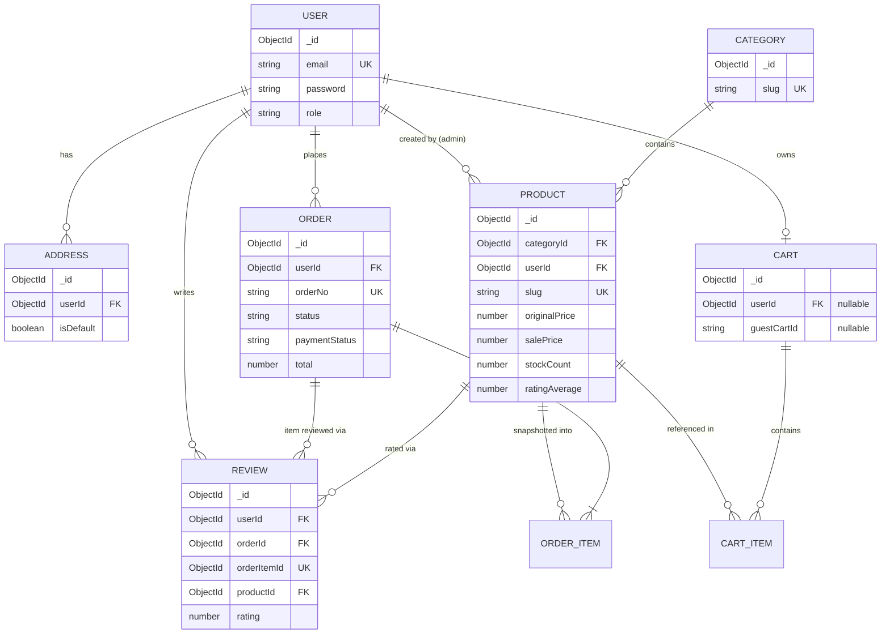

# E-Commerce Platform — Technical Blueprint

### MERN Analysis → Angular + NestJS Rebuild Plan

> Source of truth legend used throughout this document:
> **[CONFIRMED]** — verified directly from source code.
> **[INFERRED]** — reasonably deduced from implementation, not explicitly stated.
> **[RECOMMENDATION]** — proposed for the new Angular + NestJS system; does not exist today.

---

## 1. Project Overview

**Project name:** `MERN-AI-Ecommerce-Platform` (repo name), branded "AI Ecommerce Platform" in the README. **[CONFIRMED]**

**Purpose / business idea:** A grocery-style e-commerce storefront where customers browse products by category, buy as a guest or a signed-in user, check out with card (Stripe) or Cash on Delivery, track orders through a defined status pipeline, and review items after delivery. An admin back-office manages the product catalog (with AI-assisted copywriting) and order fulfillment. **[CONFIRMED]** (`prds/backend_prd.md`, controllers, models)

Despite being called "Ecommerce Platform" generically, the actual domain content (units like `pc`, AI prompts referencing "online grocery store", "Fresh Bananas", delivery-fee/free-delivery-threshold business rules) shows this is modeled specifically as a **grocery / instant-delivery store**, not a generic multi-category marketplace. **[INFERRED]** (`lib/ai/prompt.ts`, `constants/constant.ts`)

**Target users / main user types [CONFIRMED]** (`constants/enums.ts USER_ROLES`, guest-cart logic):

- **Guest** — unauthenticated visitor with a cookie-based cart identity.
- **User** (`role: "user"`) — registered customer.
- **Admin** (`role: "admin"`) — back-office operator.

**Core business domains [CONFIRMED]:** Auth, Catalog (Products/Categories), Cart (guest + user), Addresses, Orders/Checkout, Payments (Stripe), Reviews/Ratings, Admin (Products, Orders, Analytics, AI content generation).

**External services [CONFIRMED]:**

- **MongoDB** — primary datastore (Mongoose ODM).
- **Stripe** — card checkout (Hosted Checkout Session) + webhooks for payment confirmation.
- **Cloudinary** — product image hosting (upload via Multer memory storage → Cloudinary stream upload).
- **Vercel AI SDK (`ai` npm package) + Gemini (`google/gemini-2.5-flash-lite`)** — admin-only AI copy generation (title rephrasing, description generation).

**Technology stack [CONFIRMED]** (`package.json` files):

| Layer                  | Technology                                                                                                |
| ---------------------- | --------------------------------------------------------------------------------------------------------- |
| Backend runtime        | Node.js, Express 5, TypeScript                                                                            |
| Backend build          | `tsup` (bundling), `ts-node`/`nodemon` (dev)                                                              |
| Database               | MongoDB via Mongoose 9                                                                                    |
| Auth                   | JWT (jsonwebtoken) via Passport `passport-jwt`, HTTP-only cookies                                         |
| Validation             | Zod                                                                                                       |
| File upload            | Multer (memory storage) → Cloudinary                                                                      |
| Payments               | Stripe SDK                                                                                                |
| Frontend               | React 19, TypeScript, Vite                                                                                |
| Frontend routing       | React Router v7 (`createBrowserRouter`)                                                                   |
| Frontend data-fetching | TanStack React Query v5                                                                                   |
| Frontend client-state  | Zustand (+ `persist` middleware for cart)                                                                 |
| Forms                  | React Hook Form + `@hookform/resolvers` (Zod likely)                                                      |
| UI                     | Tailwind CSS v4, shadcn/ui (Radix primitives), `lucide-react` icons, `sonner` toasts, `motion` animations |
| Maps                   | Leaflet / react-leaflet (present in deps; usage not confirmed in inspected pages)                         |

**High-level architecture [CONFIRMED]:** Classic **monorepo, two-package MERN** app — `backend/` (Express REST API) and `client/` (Vite React SPA) — with the built React app served statically by Express in production (`index.ts`, `NODE_ENV === "production"` branch). Not a monorepo tool (no Nx/Turborepo); just two sibling folders with independent `package.json`s.

---

## 2. Current MERN Architecture

### 2.1 Actual repository tree (trimmed to meaningful files) [CONFIRMED]

```
MERN-AI-Ecommerce-Platform/
├── prds/
│   ├── backend_prd.md
│   └── frontend_prd.md
├── testsprite_tests/                 # AI-generated QA test suite + report (TestSprite tool)
│
├── backend/
│   └── src/
│       ├── index.ts                  # Express app bootstrap
│       ├── config/
│       │   ├── env.config.ts         # typed env accessor
│       │   ├── http.config.ts        # HTTP status constants
│       │   ├── database.config.ts    # Mongo connection
│       │   ├── passport.config.ts    # JWT strategy + optionalCartAuth middleware
│       │   ├── stripe.config.ts      # Stripe client
│       │   └── cloudinary.config.ts  # Cloudinary client
│       ├── constants/
│       │   ├── enums.ts              # USER_ROLES, ORDER_STATUS, PAYMENT_STATUS, PAYMENT_METHODS
│       │   └── constant.ts           # FREE_DELIVERY_THRESHOLD, DELIVERY_FEE, TAX_RATE
│       ├── models/                   # Mongoose schemas (7 domain models)
│       ├── validators/               # Zod schemas per domain
│       ├── routes/                   # Express routers per domain + webhook.route.ts
│       ├── controllers/              # thin HTTP handlers (parse → call service → respond)
│       ├── services/                 # business logic (DB access lives here)
│       ├── middlewares/              # asyncHandler, errorHandler, multer, requireAdmin
│       ├── webhooks/stripe.webhook.ts
│       ├── lib/ai/                   # AI provider abstraction + prompts
│       ├── utils/                    # app-error, bcrypt, cart calc, cloudinary, cookie, order#, price
│       ├── seeds/                    # category/product seed scripts
│       ├── types/express.d.ts        # Express Request augmentation (req.user, req.guestCartId)
│       └── tests/                    # Jest-style tests per domain (address, admin, auth, cart, category, order, product, review)
│
└── client/
    └── src/
        ├── main.tsx                  # React root: QueryClientProvider, ThemeProvider, Toaster
        ├── App.tsx                   # RouterProvider
        ├── routes/
        │   ├── route.ts              # route path constants + route→component tables
        │   ├── index.tsx             # createBrowserRouter tree, layout composition
        │   └── protected-guard.tsx   # auth gate for protected/admin routes
        ├── layouts/                  # AppLayout, AccountLayout, AdminLayout
        ├── pages/                    # home, products, product-detail, search-results,
        │                             # checkout, orders, account, admin (route-level screens)
        ├── components/               # nav, footer, cart-sheet, product-card, auth-dialog, ui/ (shadcn)
        ├── hooks/                    # use-auth (Zustand modal state), use-user (React Query),
        │                             # use-cart (Zustand+persist, optimistic cart), use-debounce, use-mobile
        ├── lib/
        │   ├── api.ts                # every backend call, typed request/response functions
        │   ├── axios-client.ts       # Axios instance, withCredentials, error interceptor
        │   └── env.ts                # VITE_BASE_API_URL
        ├── types/                    # TS types mirroring backend response shapes
        ├── constants/                # address/checkout/orders UI constants
        └── utils/                    # helper, status (order status → label/color mapping likely)
```

### 2.2 Directory responsibilities

- **`backend/src/config`** — all external-service/client initialization and cross-cutting config lives here; nothing else in the codebase talks to Mongo/Stripe/Cloudinary directly except through these modules or the models/services that import them. **[CONFIRMED]**
- **`backend/src/routes`** — pure routing + middleware composition (`passportAuthenticateJwt`, `requireAdmin`, `optionalCartAuth`, `multer`). No business logic. **[CONFIRMED]**
- **`backend/src/controllers`** — HTTP boundary only: parse+validate input with a Zod schema, call exactly one service function, shape the JSON response. No direct Mongoose calls found in any controller. **[CONFIRMED]**
- **`backend/src/services`** — 100% of database queries, aggregation pipelines, Stripe session creation, and cross-model orchestration (e.g., merging guest cart into user cart, order creation reducing stock) live here. This is the **true business-logic layer**. **[CONFIRMED]**
- **`backend/src/models`** — Mongoose schemas own their own derived-field logic via `pre("validate")`/`pre("save")` hooks (e.g., slug generation, sale-price calculation, password hashing). This is a deliberate "fat model" pattern for invariants that must **always** hold regardless of which service touches the document. **[CONFIRMED]**
- **`backend/src/validators`** — one Zod schema (and inferred TS type) per input shape; imported by both the controller (`.parse`) and re-exported as a type for the service layer. **[CONFIRMED]**
- **`backend/src/middlewares`** — `asyncHandler` (removes try/catch boilerplate), `errorHandler` (single funnel that turns `ZodError`/`AppError`/unknown errors into a consistent JSON error shape), `requireAdmin`, Multer file-upload config. **[CONFIRMED]**
- **`backend/src/webhooks`** — isolated from `routes/` conceptually (mounted before body-parsing middleware in `index.ts` specifically so Stripe's raw-body signature check works) — this is an important ordering detail: `app.use("/api/webhook", webhookRouter)` runs **before** `express.json()`. **[CONFIRMED]**
- **`client/src/lib/api.ts`** — the entire frontend↔backend contract is centralized in one file of typed functions; components never call `axios`/`fetch` directly. **[CONFIRMED]**
- **`client/src/hooks`** — clear split between **server state** (React Query: `use-user`) and **client/UI state** (Zustand: `use-auth` modal visibility, `use-cart` optimistic local cart mirrored to server). **[CONFIRMED]**
- **`client/src/routes`** — route table is data-driven (`route.ts` exports arrays consumed by `index.tsx`), and route protection is centralized in one `ProtectedGuard` component wrapping route subtrees rather than scattered per-page checks. **[CONFIRMED]**

### 2.3 Frontend ↔ Backend communication

Axios instance (`axios-client.ts`) with `withCredentials: true`, calling `VITE_BASE_API_URL + /api/*`. Auth is **cookie-based** (`instant_access_token` httpOnly JWT cookie), not Authorization headers — meaning React Query/Axios never touch the token directly; the browser sends it automatically. **[CONFIRMED]**

### 2.4 Where things live

- **Business logic:** `backend/src/services/*` (and derived-field logic in `backend/src/models/*` hooks). **[CONFIRMED]**
- **Authentication logic:** `backend/src/config/passport.config.ts` (JWT strategy + `optionalCartAuth` dual-mode middleware), `backend/src/utils/cookie.util.ts` (cookie issuance), `backend/src/services/auth.service.ts` (register/login + guest-cart merge orchestration). **[CONFIRMED]**
- **Database logic:** exclusively inside `backend/src/services/*.ts`; models are schema+invariants only, no query helpers defined on them beyond `comparePassword`. **[CONFIRMED]**

---

## 3. Current Architecture Evaluation

### Strengths **[CONFIRMED / assessed against the code]**

1. **Consistent layered separation** (Route → Controller → Service → Model) applied uniformly across all 8 domains — no domain skips a layer or calls Mongoose from a controller.
2. **Single validation source of truth**: Zod schemas double as runtime validators and static types (`z.infer`), avoiding drift between request typing and validation.
3. **Centralized error handling**: one `errorHandler` middleware normalizes `ZodError`, custom `AppError` subclasses, and unknown errors into one JSON shape (`message`, `errorCode`, optional `errors[]`).
4. **Server-side price/tax/delivery recalculation everywhere money is involved** (`utils/cart.util.ts::calculateCartTotals` is the single function used by cart view, cart upsert, and order creation) — the client-sent price is never trusted, satisfying the PRD's core validation criterion.
5. **Correct guest→auth cart merge design**: dedicated `mergeGuestCartService` with quantity-summing merge logic, invoked identically from both register and login flows.
6. **Idempotent-ish Stripe webhook handling**: order status transition is driven by webhook events (`checkout.session.completed` / `.expired`), not by the client redirect — the safer pattern for payment confirmation.
7. **Transactional review creation**: `review.service.ts::createReviewService` uses a Mongo session/transaction to atomically create the review, flag the order item as reviewed, and recompute the product's rating aggregate — preventing a broken rating average if one step fails.
8. **Clear API/type contract mirrored 1:1 on the frontend** (`client/src/types/*` closely match backend response shapes), making the API easy to consume predictably.

### Weaknesses **[CONFIRMED]**

1. **Critical: frontend route/admin guard is stubbed out.** `client/src/routes/protected-guard.tsx` has the real `useUser()` call commented out and replaced with hardcoded `const data = {name:"John"}` / `isLoading = false`. `client/src/layouts/admin-layout.tsx` similarly hardcodes `user = { isAdmin: true }` instead of calling the real auth hook. **This means the client-side route guard currently does not actually verify authentication or admin role — any visitor can reach `/checkout`, `/orders`, and the entire `/admin` UI shell.** This is not a security hole for **data** (every sensitive backend endpoint is still independently protected by `passportAuthenticateJwt`/`requireAdmin`, so API calls will still 401/403), but it is a real UX/security bug: unauthenticated users see admin screens and protected pages render before being denied data, and it must be fixed (uncomment/wire `useUser()`) before this is production-appropriate.
2. **Duplicated pagination/response-shaping code**: nearly identical `{ page, limit, total, totalPages, hasNextPage, hasPrevPage }` blocks are hand-written in `product.service.ts`, `admin.service.ts`, and `product.service.ts` (reviews) — a shared pagination helper would remove ~6 copies of the same math.
   2b. **Loose typing at service boundaries**: several services and most `lib/api.ts` admin functions return `Promise<any>` (e.g., `getReviewableOrderItemsQueryFn`, `getAdminAnalyticsQueryFn`, `createReviewMutationFn`), losing type safety exactly where the rest of the codebase is otherwise disciplined about it.
3. **`ai.service.ts` and `admin.controller.ts` have no rate limiting or per-admin usage caps** on AI generation calls — a cost/abuse surface if the admin panel were exposed to many operators.
4. **No refresh-token mechanism**: JWT cookie has a fixed 7-day expiry (`SEVEN_DAYS` in `cookie.util.ts`) with no silent-refresh flow; the user must fully re-authenticate after expiry.
5. **`review.model.ts`'s `orderItemId` uniqueness is enforced only via a Mongoose `unique: true` index**, not also checked with a transaction-safe pre-check race condition guard beyond the existing `findOne` check inside the transaction — acceptable, but a duplicate-key error would currently surface as a generic 500 rather than a friendly "already reviewed" error if the pre-check ever raced.
6. **Minor: dead/commented code left in shipped source** (`order.model.ts`'s commented-out `pre("validate")` hook, `use-cart.ts`'s commented-out fallback toast block, `admin.route.ts` registers `/analytics` twice) — harmless but signals the codebase was scaffolded quickly (consistent with the AI/tooling-assisted build implied by `AGENTS.md`/`MCP.md`/TestSprite artifacts).
7. **No image optimization/resizing pipeline**: Cloudinary upload stores originals as-is; no `eager` transformations or responsive variants are configured in `cloudinary.util.ts`.
8. **Cart identity fragility**: guest cart identity depends entirely on a cookie (`instant_guest_cart_id`); clearing cookies or switching devices loses the guest cart with no fallback (e.g., localStorage id backup) — though `use-cart.ts` does separately persist cart line-items to `localStorage` via Zustand `persist`, so the **UI** state might survive while the **server-side guest cart document** becomes orphaned, creating a subtle desync risk between client cart and server cart on guest checkout attempts.

Note: none of the above weaknesses are penalized simply for being "not how NestJS/Angular would do it" — they are functional or maintainability issues in the code as written.

---

## 4. User Roles & Permissions

**Roles [CONFIRMED]:** Guest, User, Admin (`USER_ROLES = { USER: "user", ADMIN: "admin" }`).

### Permissions matrix **[CONFIRMED, derived from route middleware chains]**

| Feature                                        |         Guest          | User | Admin |
| ---------------------------------------------- | :--------------------: | :--: | :---: |
| Browse products / categories / deals           |           ✅           |  ✅  |  ✅   |
| View product detail + reviews                  |           ✅           |  ✅  |  ✅   |
| Add/update/view cart                           | ✅ (guest-cart cookie) |  ✅  |  ✅   |
| Register / Login                               |           ✅           |  —   |   —   |
| View own auth status                           |           ❌           |  ✅  |  ✅   |
| Manage saved addresses                         |           ❌           |  ✅  |  ✅   |
| Checkout / create order                        |           ❌           |  ✅  |  ✅   |
| View own order history / tracking              |           ❌           |  ✅  |  ✅   |
| Submit product review (post-delivery)          |           ❌           |  ✅  |  ✅   |
| View own reviews                               |           ❌           |  ✅  |  ✅   |
| View admin analytics                           |           ❌           |  ❌  |  ✅   |
| View/manage all orders                         |           ❌           |  ❌  |  ✅   |
| Update order status                            |           ❌           |  ❌  |  ✅   |
| Create products / upload product images        |           ❌           |  ❌  |  ✅   |
| List products (admin view, all incl. inactive) |           ❌           |  ❌  |  ✅   |
| Use AI content generation (title/description)  |           ❌           |  ❌  |  ✅   |

Enforcement mechanism **[CONFIRMED]**: `passportAuthenticateJwt` (route-level `router.use`) gates all `User`-only routes; `requireAdmin` middleware (checked after JWT auth) gates all `admin.route.ts` endpoints; the cart route alone uses the dual-mode `optionalCartAuth` to support both guest and authenticated identities on the same endpoints.

There is **no evidence of finer-grained permissions** (e.g., multiple admin sub-roles, product-owner-only edit rights) — `userId` is stored on `Product` at creation but never checked for update/delete authorization (in fact, no update/delete product endpoints exist at all in the current backend — see §8). **[CONFIRMED]**

---

## 5. Complete Feature Inventory

For each feature: purpose · frontend behavior · backend behavior · DB/external deps · auth requirement · notable edge cases.

### 5.1 Authentication (Register / Login / Logout / Status) **[CONFIRMED]**

- **Purpose:** account creation and session establishment.
- **Frontend:** `auth-dialog.tsx` (modal, driven by `useAuth` Zustand store's `isAuthOpen`/`view`), forms presumably via React Hook Form; `useUser()` (React Query) fetches `/auth/status` for current session (though currently bypassed by the guard bug in §3).
- **Backend:** `auth.controller.ts` → `auth.service.ts`. Register hashes password via Mongoose `pre("save")` hook (bcryptjs, 10 salt rounds); duplicate email → `BadRequestException`. Login compares password via `user.comparePassword`. Both issue a signed JWT cookie (`setJwtAuthCookie`) and, if a guest cart cookie exists, **merge the guest cart into the new/matched user's cart** and clear the guest cookie.
- **DB:** `User` model.
- **Edge cases:** login/register both trigger cart merge — so a guest who registers keeps their cart; email is lowercased/trimmed at schema level to reduce duplicate-account risk from casing.

### 5.2 Guest Cart System **[CONFIRMED]**

- **Purpose:** allow shopping without forced signup.
- **Mechanism:** `optionalCartAuth` middleware — if no `instant_access_token` cookie, generates/reads `instant_guest_cart_id` (crypto UUID prefixed `guest_`) and sets it as a 14-day httpOnly cookie; cart documents are keyed by `guestCartId` instead of `userId`.
- **Merge on auth:** see §5.1.

### 5.3 Shopping Cart (Add/Update/Remove/View) **[CONFIRMED]**

- **Frontend:** `use-cart.ts` — **optimistic** Zustand store: local state updates instantly, then a **500ms debounced** full-cart sync (`updateCartMutationFn`, i.e. `POST /cart` with the entire item list) is sent to the server; on failure, a snapshot-based rollback restores prior state and a toast reports the error. Cart line items also persist to `localStorage` (Zustand `persist`, `partialize` to `items` only) for cross-reload continuity, then are reconciled against server truth via `fetchCart()`.
- **Backend:** `cart.controller.ts`/`cart.service.ts` — `upsertCartService` fully replaces the item list (not a diff/patch), deduplicates by `productId`, drops invalid/inactive products, **clamps requested quantity to available stock** (`Math.min(item.quantity, product.stockCount)`), and returns fresh computed totals (subtotal/delivery/tax/order total) via `calculateCartTotals`. `getCartService` mirrors the same totals computation for read.
- **DB:** `Cart` model (embedded `items[]` of `{productId, quantity}`), `Product` (read-only, for pricing/stock join).
- **Edge cases:** cart with zero valid items still resolves cleanly to an empty-cart shape rather than erroring; stock changes between add-to-cart and next sync are silently clamped, not surfaced as an explicit "quantity reduced" notice to the user server-side (frontend does have a `checkStock` pre-check using cached `stockCount`, but that can be stale).

### 5.4 Product Catalog, Search, Filtering, Sorting, Pagination **[CONFIRMED]**

- **Endpoints:** `GET /products` (filterable/sortable/paginated list), `GET /products/deals` (discounted, in-stock, sorted by discount desc), `GET /products/:slug` (detail + up to 6 related products from same category), `GET /products/:slug/reviews` (paginated reviews + star-count breakdown).
- **Filters supported:** `categoryId`, `hasDiscount`, `inStock`, `minPrice`/`maxPrice`, free-text `keyword` (regex match on `name`/`description`, case-insensitive), `sort` (`best-match` = newest, `price-low`, `price-high`, `highest-rating`).
- **Frontend pages:** `pages/products`, `pages/product-detail`, `pages/search-results` — consume the above via `lib/api.ts` functions, keyed for React Query caching presumably by params (not directly inspected at hook-usage level, but `ProductParams` type matches the query schema 1:1).
- **Edge cases:** `skip` can be passed to override standard `(page-1)*limit` pagination math (used for infinite-scroll-style loading, inferred from having both `page` and `skip` as independent optional params).

### 5.5 Categories **[CONFIRMED]**

- Read-only public endpoint `GET /categories` (active categories only, sorted by `_id`). No create/update/delete endpoint exists in the current backend — categories are seeded via `seeds/category.seed.ts`, not managed through the admin UI/API. **[CONFIRMED — gap, not assumption]**

### 5.6 Product Images / Cloudinary **[CONFIRMED]**

- Admin-only `POST /admin/products/upload` — Multer memory storage (max 10 files/5MB each, image MIME types only) → `uploadMultipleImagesToCloudinary` streams each buffer to Cloudinary and returns hosted URLs, which the admin UI then attaches to the product-creation payload (`images: string[]`) — a two-step "upload then create" flow, not a single multipart product-creation request.

### 5.7 Ratings & Reviews **[CONFIRMED]**

- **Eligibility rule:** a user may review an order item **only if** its parent order has `status === "delivered"` **and** `paymentStatus === "paid"`, and that specific `orderItemId` has not already been reviewed (enforced both by an app-level `findOne` pre-check and a DB unique index on `orderItemId`).
- **Side effects on review creation (transactional):** review doc created → order item flagged `isReviewed: true` → product's `ratingAverage`/`reviewCount` recomputed from a fresh aggregation over all reviews for that product.
- **Discovery endpoint:** `GET /reviews/reviewable` returns the user's delivered/paid orders filtered down to only their not-yet-reviewed items — directly powers a "write a review" prompt UI.
- **Frontend:** `pages/account/reviews.tsx`.

### 5.8 Addresses **[CONFIRMED]**

- `POST /addresses` creates an address and **atomically unsets any previous default** (`updateMany({isDefault:true}) → isDefault:false`) before inserting the new one as default — meaning **every newly added address becomes the default**; there is no dedicated "set as default"/edit/delete endpoint. `GET /addresses` lists sorted default-first, newest-first.

### 5.9 Checkout / Order Creation **[CONFIRMED]**

- `POST /orders` (auth required): loads the user's cart (must be non-empty), validates the chosen address belongs to the user, recomputes totals server-side from the live cart, snapshots each order item (name/image/prices at time of purchase — **price is frozen on the order**, immune to later product price changes), snapshots the shipping address into the order (not a live reference).
- **Cash on Delivery branch:** order created with `paymentStatus: "pending"`/`status: "placed"` (schema defaults), cart deleted immediately, stock decremented immediately per item.
- **Card branch:** a Stripe Checkout Session is created (one line item per cart item + separate line items for delivery fee and tax if non-zero), `metadata.orderId` links the session back to the Mongo order; **cart is NOT deleted and stock is NOT decremented yet** — both happen only when the webhook confirms payment (§5.10). The API response returns `{ stripeUrl }` for redirect; no `order` object is returned in the card branch (confirmed asymmetry vs. COD branch, which returns `{ order, stripeUrl: null }`).

### 5.10 Stripe Payment Webhook **[CONFIRMED]**

- Mounted with raw body parsing (must precede `express.json()`), signature-verified via `STRIPE_WEBHOOK_SECRET`.
- `checkout.session.completed` → order `paymentStatus: paid`, `status: confirmed`, status-history entry appended, cart deleted, stock decremented per item.
- `checkout.session.expired` → order `paymentStatus: failed`, `status: cancelled`, history appended.
- Unknown `orderId` or malformed metadata → responds `200 { received: true }` without side effects (correct Stripe-recommended behavior to avoid retry storms).

### 5.11 Order Tracking / History **[CONFIRMED]**

- `GET /orders` (own orders, newest first), `GET /orders/:id` (single order, ownership-checked via `{_id, userId}` query — returns 404 rather than 403 if another user's order id is requested, avoiding leaking existence). `statusHistory[]` on the order (status + optional note + date) is the backing data for a tracking timeline UI (`pages/orders/order-tracking.tsx`).
- **Order status pipeline [CONFIRMED, `ORDER_STATUS` enum]:** `placed → confirmed → assigned → packed → out_for_delivery → delivered`, plus terminal `cancelled`. Admin's allowed transition targets exclude `placed` (`VALID_ADMIN_ORDER_STATUS_VALUES` filters it out — admins can't manually revert/set an order back to "placed").

### 5.12 Admin Dashboard & Analytics **[CONFIRMED]**

- `GET /admin/analytics` returns `totalSales` (sum of `total` across paid orders via aggregation), `totalOrders`, `totalUsers`, `totalProducts`, `totalOutOfStock` (products with `stockCount <= 0`) — five parallelized queries (`Promise.all`).
- `GET /admin/orders` — paginated, populates buyer's `name`/`email`.
- `PUT /admin/orders/:id/status` — appends to `statusHistory` only if that status isn't already present in history (idempotency guard against duplicate log entries on repeated identical updates), auto-marks `paymentStatus: paid` if manually transitioned to `delivered` while still unpaid (covers COD orders, which are never touched by the Stripe webhook).

### 5.13 Admin Product Management **[CONFIRMED, with an important gap]**

- `POST /admin/products` (create only) and `GET /admin/products` (paginated list including inactive products, unlike the public list). **No update or delete/deactivate product endpoint exists in the current backend.** `isActive` is settable only at creation time. This is a real functional gap versus what an admin dashboard implies. **[CONFIRMED — must be called out to the person, not silently "fixed" in documentation]**

### 5.14 AI-Assisted Admin Content Generation **[CONFIRMED]**

- `POST /admin/ai/generate` with `action: "rephrase-title" | "generate-desc"`. Uses Vercel AI SDK `generateText` against `google/gemini-2.5-flash-lite` with two hand-written system prompts tuned specifically for **grocery** product copy (Instacart-style comma-attribute titles). Pure text-in/text-out, no persistence of AI history/audit trail.

### 5.15 Testing **[CONFIRMED]**

- Backend: `src/tests/{address,admin,auth,cart,category,order,product,review}` — no top-level `product-detail`/`checkout`/`webhook` test folder observed; test runner not explicit in `package.json` scripts (no `"test"` script present — tests may be run ad hoc or were scaffolded by tooling without wiring a script). **[CONFIRMED gap]**
- Root-level `testsprite_tests/` — a **generated** Python API test suite + an HTML/JSON test report produced by the third-party "TestSprite" tool mentioned in the README, covering login, product query, cart items, addresses, checkout, Stripe session creation, get-orders, review creation, admin analytics, admin order-status update (10 test cases, `TC001`–`TC010`). This is QA tooling output, not hand-written application tests.

---

## 6. User Flows

### Guest Shopping → Registration → Cart Merge **[CONFIRMED]**

```
Guest visits site
 ↓
optionalCartAuth issues instant_guest_cart_id cookie
 ↓
Guest adds items → POST /cart (upsert, keyed by guestCartId)
 ↓
Guest opens auth-dialog → submits Register form
 ↓
POST /auth/register  (guestCartId read from cookie)
 ↓
registerService: create User (password hashed in pre-save hook)
 ↓
mergeGuestCartService: guest cart items merged into new user's cart
 (quantities summed for overlapping products)
 ↓
Guest cart document deleted; guest-cart cookie cleared
 ↓
JWT cookie issued (setJwtAuthCookie) → 201 { user }
 ↓
Frontend: useUser() cache invalidated/refetched → cart re-synced via fetchCart()
```

### Checkout — Card Payment **[CONFIRMED]**

```
Authenticated user → Checkout page → selects/creates address → chooses "card"
 ↓
POST /orders { addressId, paymentMethod: "card" }
 ↓
Load user's Cart → validate non-empty → validate address ownership
 ↓
calculateCartTotals() from live product prices (server truth, not client cart)
 ↓
Order.create({ ...snapshotted items & address, paymentStatus: pending, status: placed })
 ↓
Build Stripe line_items (products + delivery fee + tax as separate lines)
 ↓
stripe.checkout.sessions.create({ metadata: { orderId } })
 ↓
201 { stripeUrl }  →  frontend redirects browser to Stripe Checkout
 ↓
[Stripe hosted page: user pays]
 ↓
Stripe → POST /api/webhook/stripe  (raw body, signature verified)
 ↓
checkout.session.completed:
   order.paymentStatus = paid, order.status = confirmed, statusHistory += confirmed
   Cart deleted (userId)
   Product.stockCount -= quantity  (per item)
 ↓
Stripe redirects browser to success_url = `${FRONTEND}/orders/{orderId}`
 ↓
Frontend: GET /orders/:id → renders order-tracking page
```

### Checkout — Cash on Delivery **[CONFIRMED]**

```
POST /orders { addressId, paymentMethod: "cash_on_delivery" }
 ↓
Order.create({ paymentStatus: pending, status: placed })
 ↓
Cart deleted immediately; stock decremented immediately
 ↓
201 { order, stripeUrl: null }  →  frontend navigates directly to order confirmation
```

### Product Review Flow **[CONFIRMED]**

```
User's order reaches status=delivered AND paymentStatus=paid
 ↓
GET /reviews/reviewable → order items eligible & not yet reviewed
 ↓
User submits rating+comment for one orderItemId
 ↓
POST /reviews { orderId, orderItemId, rating, comment }
 ↓
Validate order ownership + delivered/paid + item exists + not already reviewed
 ↓
[transaction] Review.create → Order.items.$.isReviewed = true →
              recompute Product.ratingAverage/reviewCount from aggregate
 ↓
201 { review }
```

### Admin: Update Order Status **[CONFIRMED]**

```
Admin dashboard → Orders table → select order → choose new status (not "placed")
 ↓
PUT /admin/orders/:id/status { status, note? }
 ↓
Append to statusHistory only if that status isn't already logged
 ↓
If new status === delivered AND paymentStatus !== paid → force paymentStatus = paid
 ↓
order.save() → 200 { order }
```

### Admin: Create Product (with image upload) **[CONFIRMED, two-step]**

```
Admin fills product form, selects images
 ↓
POST /admin/products/upload (multipart, up to 10 images) → { images: string[] } (Cloudinary URLs)
 ↓
Admin optionally clicks "AI generate" → POST /admin/ai/generate → title/description suggestion
 ↓
POST /admin/products { ...fields, images: [urls from step 1] }
 ↓
Validate categoryId exists → Product.create (slug + salePrice auto-derived in pre-save hook)
 ↓
201 { product }
```

---

## 7. Database Analysis

### 7.1 Models **[CONFIRMED — all fields from `backend/src/models/*.ts`]**

**User**
| Field | Type | Notes |
|---|---|---|
| name | String, required | |
| email | String, required, unique, lowercase, trim | |
| password | String, required, minlength 6 | hashed pre-save; stripped from `toJSON` output |
| role | enum `user`\|`admin` | default `user` |
| phone | String, optional | |
| avatar | String, optional | |
| timestamps | createdAt/updatedAt | |
| method | `comparePassword(candidate)` | bcrypt compare |

**Product**
| Field | Type | Notes |
|---|---|---|
| userId | ObjectId → User, required | creator/owner reference (not authorization-enforced) |
| categoryId | ObjectId → Category, required | |
| name | String, required | |
| slug | String, required, unique | auto-derived from `name` via `slugify` in pre-validate/pre-save |
| description | String, optional | |
| images | [String], default [] | Cloudinary URLs |
| originalPrice | Number, required, min 0 | |
| salePrice | Number, default 0 | **auto-computed** from `originalPrice` × `discountPercent` in pre-save hook — never set directly by API input for existing docs |
| discountPercent | Number, default 0, 0–100 | |
| discountLabel | String, optional | e.g. "20% OFF" free-text badge |
| unit | String, default `"pc"` | grocery unit (e.g., "1 kg", "500g") |
| stockCount | Number, default 0, min 0 | |
| ratingAverage | Number, default 0, 0–5 | recomputed by review aggregate |
| reviewCount | Number, default 0 | recomputed by review aggregate |
| isActive | Boolean, default true | soft "published" flag; filters all public queries |
| timestamps | | |

**Category**
| Field | Type | Notes |
|---|---|---|
| name | String, required | |
| slug | String, required, unique | auto-derived |
| imageUrl | String, nullable | |
| description | String, optional | |
| isActive | Boolean, default true | |

**Cart**
| Field | Type | Notes |
|---|---|---|
| userId | ObjectId → User, nullable | null for guest carts |
| guestCartId | String, nullable | null once merged into a user cart |
| items | [{ productId (ref Product), quantity (min 1, default 1) }] | embedded, no own `_id` per item (`_id:false`) |
| timestamps | | |

**Address**
| Field | Type | Notes |
|---|---|---|
| userId | ObjectId → User, required | |
| recipientName, phone, street, city, state, postalCode, country | String, required, trimmed | |
| isDefault | Boolean, default false | app-enforced single-default via `updateMany` on create |

**Order**
| Field | Type | Notes |
|---|---|---|
| userId | ObjectId → User, required | |
| orderNo | String, required, unique | generated `ORD-{6-digit-ts}{6-hex-random}` |
| items[] | embedded `IOrderItem` | **has its own `_id`** (used as `orderItemId` for reviews); snapshots product name/image/originalPrice/discountPercent/salePrice/quantity + `isReviewed` flag at time of order |
| shippingAddress | embedded `IOrderAddress` (`_id:false`) | full address snapshot, decoupled from live `Address` doc |
| paymentMethod | enum `card`\|`cash_on_delivery`, required | |
| paymentStatus | enum `pending`\|`paid`\|`failed`\|`refunded` | default `pending` |
| status | enum (7-value pipeline, see §5.11) | default `placed` |
| statusHistory[] | `{status, note?, date}` (`_id:false`) | seeded with initial `placed` entry at creation |
| subtotal, deliveryFee, tax, total | Number, required (deliveryFee default 0) | server-computed, frozen |
| timestamps | | |

**Review**
| Field | Type | Notes |
|---|---|---|
| userId | ObjectId → User, required | |
| orderId | ObjectId → Order, required | |
| orderItemId | ObjectId, required, **unique** | references the embedded order item's own `_id`; global uniqueness prevents double-review of the same purchased item across the whole collection |
| productId | ObjectId → Product, required | |
| rating | Number, required, 1–5 | |
| comment | String, optional | |
| timestamps | | |

### 7.2 Entity relationship diagram **[CONFIRMED against schemas above]**



Note: `ORDER_ITEM` is an **embedded subdocument** of `ORDER`, not a standalone collection — modeled here for relationship clarity only.

---

## 8. API Documentation

Base path: `/api` (mounted in `index.ts`). All responses are `{ message: string, ...payload }`. All error responses are `{ message, errorCode, errors?[] }`.

### Auth (`/api/auth`) **[CONFIRMED]**

| Method | Endpoint         | Auth         | Body                                   | Notes                              |
| ------ | ---------------- | ------------ | -------------------------------------- | ---------------------------------- |
| POST   | `/auth/register` | none         | `{name,email,password,phone?,avatar?}` | merges guest cart, sets JWT cookie |
| POST   | `/auth/login`    | none         | `{email,password}`                     | merges guest cart, sets JWT cookie |
| POST   | `/auth/logout`   | none         | —                                      | clears JWT cookie                  |
| GET    | `/auth/status`   | JWT required | —                                      | returns current user or 401        |

### Products (`/api/products`) — all public **[CONFIRMED]**

| Method | Endpoint                  | Query                                                                                  | Notes                                          |
| ------ | ------------------------- | -------------------------------------------------------------------------------------- | ---------------------------------------------- |
| GET    | `/products`               | categoryId, page, limit, hasDiscount, inStock, minPrice, maxPrice, sort, keyword, skip | paginated catalog                              |
| GET    | `/products/deals`         | limit                                                                                  | discounted + in-stock, sorted by discount desc |
| GET    | `/products/:slug`         | —                                                                                      | detail + up to 6 related products              |
| GET    | `/products/:slug/reviews` | page, limit                                                                            | reviews + rating breakdown (5→1 star counts)   |

### Categories (`/api/categories`) — public **[CONFIRMED]**

| Method | Endpoint      | Notes                  |
| ------ | ------------- | ---------------------- |
| GET    | `/categories` | active categories only |

### Cart (`/api/cart`) — guest or user (`optionalCartAuth`) **[CONFIRMED]**

| Method | Endpoint | Body                             | Notes                              |
| ------ | -------- | -------------------------------- | ---------------------------------- |
| POST   | `/cart`  | `{items:[{productId,quantity}]}` | full-replace upsert, stock-clamped |
| GET    | `/cart`  | —                                | current cart + computed totals     |

### Addresses (`/api/addresses`) — auth required **[CONFIRMED]**

| Method | Endpoint     | Body                                                         | Notes                       |
| ------ | ------------ | ------------------------------------------------------------ | --------------------------- |
| POST   | `/addresses` | `{recipientName,phone,street,city,state,postalCode,country}` | always becomes new default  |
| GET    | `/addresses` | —                                                            | default-first, newest-first |

### Orders (`/api/orders`) — auth required **[CONFIRMED]**

| Method | Endpoint      | Body                        | Notes                             |
| ------ | ------------- | --------------------------- | --------------------------------- |
| POST   | `/orders`     | `{addressId,paymentMethod}` | see §5.9 for branch behavior      |
| GET    | `/orders`     | —                           | own orders                        |
| GET    | `/orders/:id` | —                           | own order only (404 if not owner) |

### Reviews (`/api/reviews`) — auth required **[CONFIRMED]**

| Method | Endpoint              | Body                                    | Notes                          |
| ------ | --------------------- | --------------------------------------- | ------------------------------ |
| POST   | `/reviews`            | `{orderId,orderItemId,rating,comment?}` | transactional, see §5.7        |
| GET    | `/reviews`            | —                                       | own reviews                    |
| GET    | `/reviews/reviewable` | —                                       | own delivered-unreviewed items |

### Admin (`/api/admin`) — auth + admin role required **[CONFIRMED]**

| Method | Endpoint                   | Body/Query                                    | Notes                                              |
| ------ | -------------------------- | --------------------------------------------- | -------------------------------------------------- |
| GET    | `/admin/analytics`         | —                                             | sales/orders/users/products/out-of-stock counts    |
| POST   | `/admin/ai/generate`       | `{action,title?,unit?,description?}`          | Gemini-backed copy generation                      |
| GET    | `/admin/orders`            | page, limit                                   | paginated, buyer populated                         |
| PUT    | `/admin/orders/:id/status` | `{status,note?}`                              | status ≠ `placed`                                  |
| GET    | `/admin/products`          | page, limit                                   | includes inactive products                         |
| POST   | `/admin/products/upload`   | multipart `images[]` (≤10, ≤5MB, image types) | → Cloudinary URLs                                  |
| POST   | `/admin/products`          | full product payload                          | create only — **no update/delete endpoint exists** |

### Webhook (`/api/webhook`) — Stripe only, raw body **[CONFIRMED]**

| Method | Endpoint          | Notes                                                                 |
| ------ | ----------------- | --------------------------------------------------------------------- |
| POST   | `/webhook/stripe` | signature-verified, handles `checkout.session.completed` / `.expired` |

### Health **[CONFIRMED]**

| Method | Endpoint  | Notes                                       |
| ------ | --------- | ------------------------------------------- |
| GET    | `/health` | `{status:"healthy"}`, outside `/api` prefix |

**Confirmed absence of endpoints** the person should be aware of before assuming feature parity: no product update/delete, no category CRUD beyond seed scripts, no address update/delete/set-default, no user profile update, no password-reset/forgot-password, no email verification, no refresh-token endpoint, no admin user-management endpoints.

---

## 9. Authentication & Security

### Current implementation **[CONFIRMED]**

- **Registration:** email uniqueness check → Mongoose `pre("save")` bcrypt-hashes password (10 rounds) → user created.
- **Login:** email lookup → `bcrypt.compare` via schema method → on success, issue JWT.
- **JWT generation:** `jsonwebtoken.sign({userId}, JWT_SECRET, {audience:["user"], expiresIn: JWT_EXPIRES_IN})`.
- **JWT storage:** **httpOnly cookie** (`instant_access_token`), not `localStorage`/Authorization header — correct practice against XSS token theft. `secure`/`sameSite:"strict"` only in production; `sameSite:"lax"` in dev.
- **Token validation:** Passport `passport-jwt` strategy, custom cookie extractor (`cookieExtractor`) reading the same cookie name; on each protected request, `findUserById` re-fetches the user from Mongo (password excluded via `.select("-password")`) — meaning a deleted/deactivated user is immediately locked out even with a still-valid token, but at the cost of a DB round-trip per authenticated request (no in-memory/JWT-payload-only trust).
- **Password hashing:** bcryptjs, 10 salt rounds, hook-driven (fires on any save where `password` is modified, not just creation).
- **No refresh tokens.** Fixed-expiry cookie only.
- **Middleware chain:** `passportAuthenticateJwt` (hard-required auth) vs. `optionalCartAuth` (soft — degrades to guest identity) vs. `requireAdmin` (role check, must run after JWT auth).
- **Protected routes:** enforced with `router.use(passportAuthenticateJwt)` at the top of each router file requiring auth (`address`, `order`, `review`, `admin` routers) rather than per-route middleware — clean and consistent.
- **No password reset / email verification / 2FA** in the current codebase.

### Security concerns identified **[CONFIRMED / assessed]**

1. **Frontend auth guard is non-functional (see §3, item 1)** — must be fixed regardless of framework; flagged again here because it is fundamentally an **auth** defect, not just a UX one.
2. **No rate limiting** on `/auth/login` or `/auth/register` (no `express-rate-limit` or equivalent in dependencies) — brute-force/credential-stuffing exposure.
3. **No account lockout / login-attempt throttling.**
4. **CORS is origin-restricted to a single `FRONTEND_ORIGIN`** — good — but methods list `["GET","POST","PUT","DELETE"]` omits `PATCH`/`OPTIONS` explicit handling (Express/cors typically handles preflight automatically, low risk, but worth confirming if a PATCH endpoint is ever added).
5. **No CSRF protection** beyond `sameSite` cookie attribute — acceptable for `sameSite:"strict"` in production, but the AI-generate and product-creation endpoints (state-changing, cookie-authenticated) rely entirely on `sameSite` rather than a CSRF token.
6. **Admin role is a single flat flag** — no audit log of admin actions (who changed an order status and when, beyond the `statusHistory.note` which is optional and often empty).
7. **Stripe webhook secret and signature check are correctly implemented** — no concern here.

### Recommendations for NestJS **[RECOMMENDATION]**

- Reproduce the httpOnly-cookie JWT pattern using `@nestjs/passport` + `passport-jwt` with a custom cookie extractor (direct architectural equivalent).
- Add `@nestjs/throttler` for login/register rate limiting.
- Add a refresh-token rotation flow (short-lived access token + longer-lived refresh token, both httpOnly cookies) if session longevity/security balance needs improving — optional, scope-dependent.
- Wrap admin-mutating endpoints with a lightweight audit-log interceptor recording `{adminId, action, targetId, timestamp}`.
- Fix the client-side guard equivalent from day one in the new Angular app (do not port the stubbed-out pattern).

---

## 10. Frontend Analysis (existing React app)

### Pages **[CONFIRMED, from `client/src/pages`]**

- `home` — landing page (banner, deals, categories, likely featured products — composed from `components/banner.tsx`, product cards).
- `products` — filterable/sortable catalog listing.
- `product-detail` — single product + related products + reviews.
- `search-results` — keyword search results.
- `checkout` (+ `checkout/components`) — address selection, payment method, order summary.
- `orders/orders` — order history list.
- `orders/order-tracking` — single order detail + status timeline.
- `account/addresses` — saved address management.
- `account/reviews` — user's submitted reviews / reviewable items.
- `admin/dashboard` — analytics cards.
- `admin/orders` — admin order table + status update.
- `admin/products` — admin product table.
- `admin/new-product` (+ `admin/components`) — product creation form with image upload + AI-assist buttons.
- `not-found` — 404 fallback.

### Layouts **[CONFIRMED]**

- `AppLayout` — public/customer shell (nav, footer, cart sheet, auth dialog presumably mounted here).
- `AccountLayout` — nested shell for `/account/*` routes (sidebar/tabs for addresses/reviews).
- `AdminLayout` — sidebar navigation (Dashboard/Orders/Products) + its own (currently stubbed) auth/role gate.

### Hooks / state management **[CONFIRMED]**

- **Server state:** React Query (`useUser` is the only explicitly inspected query hook, but the pattern — and `queryClient.setQueryData` calls seen in `admin-layout.tsx`'s logout mutation — implies React Query is the standard data-fetching layer app-wide, backed by the `lib/api.ts` functions).
- **Client/UI state:** Zustand — `useAuth` (auth-modal open/view state only, **not** the user session itself), `useCart` (full optimistic cart engine with debounced server sync and localStorage persistence, detailed in §5.3).
- **No React Context usage observed** for global state — Zustand fully replaces Context+useReducer patterns here.
- **Forms:** `react-hook-form` + `@hookform/resolvers` present in dependencies (resolver library, e.g. Zod resolver, not directly confirmed by file content inspected, but standard pairing) — used across auth-dialog, checkout, admin new-product forms. **[INFERRED for exact usage sites, CONFIRMED as a dependency]**

### Routing **[CONFIRMED]**

Fully data-driven route tables (`PUBLIC_ROUTES`, `PROTECTED_ROUTES` constants + arrays mapping path→component, some flagged `account: true` to additionally nest under `AccountLayout`). `createBrowserRouter`/`createRoutesFromElements` compose: `RootLayout` (scroll restoration) → `AppLayout` → public routes + `ProtectedGuard`-wrapped routes (further split between flat protected routes like `/checkout` and `AccountLayout`-nested routes) → separately, `ProtectedGuard` + `AdminLayout` wraps all `/admin/*` routes.

### Reusable components **[CONFIRMED]**

`nav`, `footer`, `banner`, `logo`, `mode-toggle` (theme), `cart-button`, `cart-sheet` (slide-over cart), `product-card`, `auth-dialog`, `theme-provider`, plus a full shadcn/ui primitive set under `components/ui/`.

---

## 11. Backend Analysis

Already covered structurally in §2/§5/§8. Summary of responsibility boundaries for quick reference:

| Concern                                            | Lives in                                                                                                     |
| -------------------------------------------------- | ------------------------------------------------------------------------------------------------------------ |
| Routing & middleware wiring                        | `routes/*.ts`                                                                                                |
| Request parsing/validation                         | `validators/*.ts` (Zod) consumed in `controllers/*.ts`                                                       |
| HTTP request/response shaping                      | `controllers/*.ts`                                                                                           |
| Business rules & orchestration                     | `services/*.ts`                                                                                              |
| Data invariants (slugs, price calc, password hash) | `models/*.ts` pre-hooks                                                                                      |
| Cross-cutting error normalization                  | `middlewares/errorHandler.middleware.ts` + `utils/app-error.ts`                                              |
| Auth/session                                       | `config/passport.config.ts`, `utils/cookie.util.ts`                                                          |
| External integrations                              | `config/{stripe,cloudinary}.config.ts`, `utils/cloudinary.util.ts`, `lib/ai/*`, `webhooks/stripe.webhook.ts` |

---

## 12. External Services

| Service                | Purpose                                      | Used in                                                                          | Data flow                                                              | Failure handling                                                                                  | NestJS integration **[RECOMMENDATION]**                                                                                                                                                                                                                    |
| ---------------------- | -------------------------------------------- | -------------------------------------------------------------------------------- | ---------------------------------------------------------------------- | ------------------------------------------------------------------------------------------------- | ---------------------------------------------------------------------------------------------------------------------------------------------------------------------------------------------------------------------------------------------------------- |
| MongoDB                | primary datastore                            | `config/database.config.ts`, all models                                          | Mongoose ODM                                                           | `connectDatabase` calls `process.exit(1)` on failure — hard crash on boot, no retry/backoff       | `@nestjs/mongoose` `MongooseModule.forRootAsync` with connection-event logging, no process.exit — let Nest's lifecycle/health-check handle it                                                                                                              |
| Stripe                 | card payments (Checkout Sessions + webhooks) | `config/stripe.config.ts`, `order.service.ts`, `webhooks/stripe.webhook.ts`      | server creates session → client redirected → Stripe posts webhook back | webhook signature failure → 400, no order mutation; unknown/missing orderId → 200 no-op (correct) | dedicated `PaymentsModule` with a `StripeService`; webhook controller must use Nest's raw-body option (`rawBody: true` in `NestFactory.create` + `express.raw` on that specific route) — mirror the current "mount before json parser" ordering constraint |
| Cloudinary             | product image hosting                        | `config/cloudinary.config.ts`, `utils/cloudinary.util.ts`, admin upload endpoint | Multer memory buffer → stream upload → secure URL returned             | unhandled Cloudinary errors are logged and rethrown (500)                                         | `CloudinaryModule` wrapping the SDK client as a provider; keep Multer's memory-storage + streaming pattern (avoids temp-file disk I/O)                                                                                                                     |
| Vercel AI SDK + Gemini | admin AI copywriting                         | `lib/ai/*`, `services/ai.service.ts`                                             | admin form → backend → Gemini → text back                              | no explicit error handling around `generateText` beyond falling through to global error handler   | `AiModule` with provider abstraction preserved (keep the system-prompt strategy pattern — it's good design already)                                                                                                                                        |

No email provider, SMS provider, or analytics/monitoring SaaS is present in the current stack. **[CONFIRMED — gap for a production system, worth a §29 recommendation]**

---

## 13. Recommended Angular + NestJS Architecture

### 13.1 Architectural style decision **[RECOMMENDATION]**

**Chosen approach: Feature/Domain-oriented Modular Architecture** (NestJS modules per bounded domain; Angular standalone-feature-folders per domain), each internally layered (Controller→Service→Repository-via-Schema on the backend; Component→Service(store) on the frontend) — **not** a heavyweight Clean-Architecture/hexagonal setup with explicit ports/adapters/use-case classes, and **not** NgRx by default.

**Why:** The existing MERN app has ~8 clear bounded domains (auth, catalog/products, categories, cart, addresses, orders, payments, reviews, admin/analytics), each with modest complexity (few entities, straightforward CRUD + a small number of orchestrated flows like checkout and review-creation). This is a **medium-complexity app**, not an enterprise system with dozens of aggregates or complex cross-team ownership boundaries. A domain-oriented modular structure gives:

- High cohesion (everything about "orders" — DTOs, schema, service, controller — sits together) and low coupling (each NestJS module explicitly imports only what it needs).
- Enough structure to scale the team beyond one developer without a rewrite.
- No premature complexity: full Clean Architecture (separate domain/entity layer decoupled from Mongoose, use-case interactors, repository interfaces) would add real overhead — dependency-inversion boilerplate — for business logic that in the current app is genuinely simple CRUD + a handful of orchestration flows (cart merge, checkout, review transaction). If the app's complexity grows substantially (multi-vendor, multi-warehouse, complex pricing/promotions engine), Clean Architecture becomes justified later — but not at this size today.
- This mirrors what the current backend already does well (§3 Strengths) — the recommendation is to **formalize the same layering NestJS-natively**, not to reinvent it.

### 13.2 What belongs where (Angular) **[RECOMMENDATION]**

- **`core/`** — singleton, app-wide concerns instantiated once: HTTP interceptors (auth-cookie passthrough, global error mapping), route guards, the auth session service, app-level config/environment access, and the root error handler. Nothing here is domain-specific.
- **`shared/`** — dumb, reusable, presentation-only building blocks used across ≥2 features: buttons, cards, form-field wrappers, the product-card component, pipes (currency/price formatting mirroring `price.util.ts` semantics), and shared TypeScript interfaces/DTOs that mirror backend response shapes (equivalent to today's `client/src/types/*`).
- **`layout/`** — the three shell components (`AppLayout`, `AccountLayout`, `AdminLayout` equivalents) plus nav/footer/sidebar.
- **`features/<domain>/`** — one folder per bounded domain (see tree below), each self-contained: its own routing, components, and a domain service/store. A feature should never reach into another feature's internals — cross-feature needs go through `core`/`shared` or a shared state service.
- **State:** see §15 — Angular Signals + injectable services for most domains; a light RxJS `BehaviorSubject`-based store only for cart (the one domain with genuinely complex optimistic-update + debounce-sync behavior, directly mirroring today's Zustand `useCart`).
- **Guards** live in `core/guards/` (`auth.guard.ts`, `admin.guard.ts`) — and, unlike the current React app, **must actually call the session-check service**, not be stubbed.
- **Interceptors** live in `core/interceptors/` (credentials/cookie passthrough is automatic via `withCredentials: true` on `HttpClient`, but a global error interceptor mapping the backend's `{message, errorCode}` shape into user-facing toasts belongs here).

### 13.3 What belongs where (NestJS) **[RECOMMENDATION]**

- **`common/`** — cross-cutting, reusable across modules: the `AppError`-equivalent exception classes (or Nest's built-in `HttpException` subclasses), the global exception filter (mirrors `errorHandler.middleware.ts`), shared pagination DTO/interface, shared decorators (e.g., `@CurrentUser()`).
- **`config/`** — `@nestjs/config` module setup, typed config service (mirrors `env.config.ts`), Stripe/Cloudinary client providers.
- **`database/`** — `MongooseModule.forRootAsync` setup only; no business schemas live here (those live inside each feature module, mirroring how the current app already keeps things domain-grouped rather than in one giant `models/` dump conceptually — though physically the current repo does group all schemas in one folder; the NestJS version should colocate schema+module+service+controller per domain instead, which is a genuine improvement over the current flat `models/` folder).
- **`modules/<domain>/`** — one NestJS module per bounded domain, each containing: `*.controller.ts`, `*.service.ts`, `*.schema.ts` (Mongoose schema, replacing today's `models/*.ts`), `dto/*.dto.ts` (replacing today's Zod validators — using `class-validator`/`class-transformer` decorators instead), and module-local guards if needed.
- **Guards** (`JwtAuthGuard`, `AdminGuard`, `OptionalCartAuthGuard`) live either in `common/guards/` (reused across modules, direct equivalents of `passportAuthenticateJwt`/`requireAdmin`/`optionalCartAuth`) since they're genuinely cross-domain.
- **Interceptors** — a global response-shaping interceptor could standardize the `{message, ...}` envelope (currently done manually in every controller) — a clean improvement.
- **Pipes** — Nest's built-in `ValidationPipe` (global, `class-validator`-based) replaces the current per-controller `schema.parse()` calls.
- **Filters** — one global `HttpExceptionFilter` (+ handling for Mongoose/validation errors) replaces `errorHandler.middleware.ts`.

---

## 14. Recommended Angular Architecture Tree

```
frontend/
└── src/
    └── app/
        ├── core/
        │   ├── guards/
        │   │   ├── auth.guard.ts            # replaces (and fixes) protected-guard.tsx
        │   │   └── admin.guard.ts           # replaces admin-layout.tsx's stubbed check
        │   ├── interceptors/
        │   │   └── error.interceptor.ts     # maps {message, errorCode} → toast/notification
        │   ├── services/
        │   │   ├── auth-session.service.ts  # real session state (equivalent to useUser, but as the source of truth guards depend on)
        │   │   └── config.service.ts        # equivalent of lib/env.ts
        │   └── models/                      # shared response/DTO interfaces (mirrors client/src/types)
        │
        ├── shared/
        │   ├── components/                  # product-card, price-badge, rating-stars, pagination, spinner
        │   ├── pipes/                        # currency/price formatting, order-status label/color
        │   └── directives/
        │
        ├── layout/
        │   ├── app-layout/                  # nav, footer, cart trigger — public/customer shell
        │   ├── account-layout/              # sidebar for /account/*
        │   └── admin-layout/                # sidebar for /admin/*
        │
        ├── features/
        │   ├── auth/                        # login/register dialog or page, auth forms
        │   ├── catalog/                      # product list, product detail, search-results, categories
        │   │   ├── product-list/
        │   │   ├── product-detail/
        │   │   └── search-results/
        │   ├── cart/                         # cart sheet/page, cart.store.ts (RxJS/Signals engine)
        │   ├── checkout/                     # address selection, payment method, order review
        │   ├── addresses/                    # account/addresses page
        │   ├── orders/                       # order history, order-tracking
        │   ├── reviews/                      # account/reviews, reviewable-items prompt
        │   └── admin/
        │       ├── dashboard/
        │       ├── orders/
        │       ├── products/
        │       └── new-product/              # form + image upload + AI-assist buttons
        │
        └── app.routes.ts                     # lazy-loaded feature routes (loadChildren/loadComponent)
```

**Routing:** `app.routes.ts` mirrors today's `route.ts` path-constant approach but leans on Angular's `loadComponent`/`loadChildren` for route-level lazy loading per feature (a genuine scalability improvement over the current single-bundle React Router setup — see §23).

**State management placement:** use Angular Signals + injectable feature services as the default. Use RxJS for HTTP streams, debouncing, cancellation, and multi-step async workflows. The cart may use a dedicated injectable `CartStore` service because it is shared by the layout and checkout and has debounced synchronization/persistence behavior. Do not add NgRx or ComponentStore initially; introduce them only if concrete application complexity justifies them. Guest-cart persistence must preserve the server-authoritative cookie/cart behavior rather than moving cart totals or stock rules into browser state.

---

## 15. Recommended NestJS Architecture Tree

```
backend/
└── src/
    ├── main.ts                         # bootstrap, global pipes/filters, raw-body config for Stripe route
    ├── app.module.ts
    │
    ├── common/
    │   ├── exceptions/                 # AppException + subclasses (mirrors utils/app-error.ts)
    │   ├── filters/http-exception.filter.ts
    │   ├── guards/
    │   │   ├── jwt-auth.guard.ts       # mirrors passportAuthenticateJwt
    │   │   ├── admin.guard.ts          # mirrors requireAdmin
    │   │   └── optional-cart-auth.guard.ts  # mirrors optionalCartAuth's dual-mode behavior
    │   ├── decorators/current-user.decorator.ts
    │   ├── interceptors/response.interceptor.ts
    │   └── dto/pagination.dto.ts       # shared {page,limit} query DTO + response envelope
    │
    ├── config/
    │   ├── config.module.ts            # @nestjs/config, typed + validated env (class-validator on env)
    │   ├── stripe.provider.ts
    │   └── cloudinary.provider.ts
    │
    ├── database/
    │   └── database.module.ts          # MongooseModule.forRootAsync
    │
    ├── modules/
    │   ├── auth/
    │   │   ├── auth.module.ts
    │   │   ├── auth.controller.ts      # register/login/logout/status
    │   │   ├── auth.service.ts         # + guest-cart-merge orchestration (calls cart.service)
    │   │   ├── strategies/jwt.strategy.ts   # passport-jwt, cookie extractor
    │   │   └── dto/{register,login}.dto.ts
    │   │
    │   ├── users/
    │   │   ├── users.module.ts
    │   │   ├── users.service.ts        # findById, etc. (mirrors user.service.ts)
    │   │   └── schemas/user.schema.ts
    │   │
    │   ├── categories/
    │   │   ├── categories.module.ts
    │   │   ├── categories.controller.ts
    │   │   ├── categories.service.ts
    │   │   └── schemas/category.schema.ts
    │   │
    │   ├── products/
    │   │   ├── products.module.ts
    │   │   ├── products.controller.ts  # public list/deals/detail/reviews
    │   │   ├── products.service.ts
    │   │   ├── schemas/product.schema.ts
    │   │   └── dto/{get-products,create-product}.dto.ts
    │   │
    │   ├── cart/
    │   │   ├── cart.module.ts
    │   │   ├── cart.controller.ts
    │   │   ├── cart.service.ts         # upsert/get/merge, calculateCartTotals as an injectable util
    │   │   └── schemas/cart.schema.ts
    │   │
    │   ├── addresses/
    │   │   ├── addresses.module.ts
    │   │   ├── addresses.controller.ts
    │   │   ├── addresses.service.ts
    │   │   └── schemas/address.schema.ts
    │   │
    │   ├── orders/
    │   │   ├── orders.module.ts
    │   │   ├── orders.controller.ts    # create/list/detail (customer-facing)
    │   │   ├── orders.service.ts       # checkout orchestration (cart→order, stock, Stripe session)
    │   │   └── schemas/order.schema.ts
    │   │
    │   ├── payments/
    │   │   ├── payments.module.ts
    │   │   ├── payments.controller.ts  # Stripe webhook endpoint (raw body)
    │   │   └── stripe.service.ts       # session creation used by orders.service
    │   │
    │   ├── reviews/
    │   │   ├── reviews.module.ts
    │   │   ├── reviews.controller.ts
    │   │   ├── reviews.service.ts      # transactional create + rating aggregate recompute
    │   │   └── schemas/review.schema.ts
    │   │
    │   ├── ai/
    │   │   ├── ai.module.ts
    │   │   ├── ai.service.ts
    │   │   └── prompts/                # mirrors lib/ai/prompt.ts
    │   │
    │   └── admin/
    │       ├── admin.module.ts         # imports Products/Orders/Users modules; admin-only controllers
    │       ├── admin-analytics.controller.ts
    │       ├── admin-orders.controller.ts
    │       ├── admin-products.controller.ts
    │       └── admin-analytics.service.ts
    │
    └── uploads/
        ├── uploads.module.ts
        └── cloudinary.service.ts       # Multer config + stream upload (mirrors multer.middleware.ts + cloudinary.util.ts)
```

**Key structural improvement over the current backend:** schemas move from one flat `models/` folder into their owning feature module (`modules/products/schemas/product.schema.ts` instead of `models/product.model.ts`), giving each module true self-containment — a direct fix for the "everything is domain-grouped except the schemas" inconsistency implicit in the current repo.

---

## 16A. Final Architecture Decisions

These decisions supersede older or conflicting wording elsewhere in this document and are the baseline for implementation. **[RECOMMENDATION]**

1. **Angular uses Standalone Components.** Do not create `CoreModule`, `SharedModule`, `AppModule`, or `AppRoutingModule` for the new Angular application.
2. **Angular routing uses lazy-loaded routes** with `loadComponent` and/or `loadChildren` as appropriate.
3. **Angular state starts simple:** Signals + injectable feature services, with RxJS where asynchronous/reactive composition is needed. No NgRx/ComponentStore dependency at the start.
4. **NestJS uses domain-oriented feature modules** under `src/modules/`. Each domain owns its controller, service, DTOs, and Mongoose schemas.
5. **Business logic remains server-authoritative.** Cart totals, stock, payment confirmation, review eligibility, and order rules must never be trusted from client-calculated values.
6. **Authentication keeps the current behavior:** JWT stored in an httpOnly cookie, with NestJS guards replacing the Express/Passport middleware arrangement.
7. **AI is a confirmed capability** in the current repository (`/api/admin/ai/generate` and `backend/src/lib/ai`), so the target system includes an `AiModule`. The provider integration should remain behind an `AiService` abstraction.
8. **Payments are isolated in `PaymentsModule`**, including Stripe session creation and raw-body webhook verification.
9. **Uploads/Cloudinary are isolated as infrastructure/integration code** and used by the admin/product workflows.
10. **The new system is a rebuild, not a blind rewrite:** preserve confirmed business rules and user-facing behavior while fixing explicitly documented architectural/security gaps.

## 16. MERN → Angular + NestJS Mapping

| Current MERN                                                               | New Angular + NestJS                                                                                                                                                                                                                                                               |
| -------------------------------------------------------------------------- | ---------------------------------------------------------------------------------------------------------------------------------------------------------------------------------------------------------------------------------------------------------------------------------- |
| React pages (`pages/*`)                                                    | Angular feature components (`features/<domain>/*`)                                                                                                                                                                                                                                 |
| React components (`components/*`)                                          | Angular shared/layout components                                                                                                                                                                                                                                                   |
| React hooks — server state (`use-user.ts`, React Query)                    | Angular services using `HttpClient` + Signals (`toSignal`) or RxJS observables                                                                                                                                                                                                     |
| Zustand `useAuth` (modal state)                                            | Angular Signal-based UI-state service (`AuthDialogService`)                                                                                                                                                                                                                        |
| Zustand `useCart` (+persist, debounce sync)                                | Angular injectable `CartStore` service — Signals for reactive state, RxJS `debounceTime` for the sync pipeline, direct `localStorage` read/write for persistence                                                                                                                   |
| Axios (`lib/api.ts`, `axios-client.ts`)                                    | Angular `HttpClient` wrapped in per-domain API services, `withCredentials: true`, global `HttpInterceptorFn` for error mapping                                                                                                                                                     |
| React Router (`routes/*`)                                                  | Angular Router (`app.routes.ts`, lazy `loadComponent`/`loadChildren`)                                                                                                                                                                                                              |
| `ProtectedGuard` component (currently stubbed)                             | `CanActivateFn` guards (`auth.guard.ts`, `admin.guard.ts`) — **functioning**, backed by `AuthSessionService`                                                                                                                                                                       |
| Express routes (`routes/*.route.ts`)                                       | NestJS `@Controller()` route decorators                                                                                                                                                                                                                                            |
| Express controllers (`controllers/*.ts`)                                   | NestJS controllers (same responsibility: parse via DTO, delegate to service)                                                                                                                                                                                                       |
| Express services (`services/*.ts`)                                         | NestJS injectable services (near 1:1 logic port)                                                                                                                                                                                                                                   |
| `passportAuthenticateJwt` / `requireAdmin` / `optionalCartAuth` middleware | NestJS `Guard`s (`JwtAuthGuard`, `AdminGuard`, `OptionalCartAuthGuard`)                                                                                                                                                                                                            |
| Zod validators (`validators/*.ts`)                                         | NestJS DTOs + `class-validator` decorators + global `ValidationPipe`                                                                                                                                                                                                               |
| `errorHandler.middleware.ts` + `utils/app-error.ts`                        | Global `HttpExceptionFilter` + custom exception classes extending `HttpException`                                                                                                                                                                                                  |
| Mongoose models (`models/*.ts`)                                            | NestJS `@Schema()` classes via `@nestjs/mongoose`, colocated per feature module                                                                                                                                                                                                    |
| Model `pre("save")` hooks (slug, price calc, hashing)                      | Preserved as Mongoose schema hooks (Nest's Mongoose integration supports this identically) or moved into the service layer as explicit steps — **recommend keeping as schema hooks** for invariants that must hold regardless of write path, consistent with current design intent |
| `asyncHandler` middleware                                                  | Not needed — Nest handles async controller methods natively                                                                                                                                                                                                                        |
| Multer middleware (`multer.middleware.ts`)                                 | Nest's `@UseInterceptors(FilesInterceptor())` (built on Multer under the hood)                                                                                                                                                                                                     |
| Stripe webhook route (raw body, mounted pre-JSON-parser)                   | Dedicated controller route with Nest's `rawBody: true` bootstrap option + explicit content-type handling for that route only                                                                                                                                                       |
| `lib/ai/*`                                                                 | `AiModule`/`AiService`, same prompt strategy preserved                                                                                                                                                                                                                             |
| Jest-ish `backend/src/tests/*`                                             | NestJS's built-in Jest integration (`@nestjs/testing` `Test.createTestingModule`) — directly portable test-writing patterns                                                                                                                                                        |

---

## 17. Business Logic Preservation

These rules must be reproduced **exactly** in the new system, regardless of framework:

1. **Cart totals formula:** `subtotal = Σ(salePrice × quantity)`; `deliveryFee = 0 if subtotal ≥ FREE_DELIVERY_THRESHOLD (20) else DELIVERY_FEE (4.99)`; `tax = round(subtotal × TAX_RATE (0.08), 2)`; `orderTotal = round(subtotal + deliveryFee + tax, 2)`. All rounding to 2 decimals.
2. **Cart quantity is always clamped** to the product's live `stockCount` on every upsert — never allow ordering more than available stock.
3. **Product `salePrice` is always derived**, never client-settable directly: `salePrice = discountPercent > 0 ? round(originalPrice × (1 − discountPercent/100), 2) : originalPrice`.
4. **Order items are immutable price/detail snapshots** taken at order-creation time — later product price/name/image changes must never retroactively alter historical orders.
5. **Stock decrements only happen once per order**, at the point payment is confirmed: immediately for Cash on Delivery, only on the `checkout.session.completed` webhook for card payments — never at order-creation time for card orders.
6. **Cart is deleted only when the order is actually confirmed** (COD: immediately; Card: only on webhook success) — never on order creation alone for card payments.
7. **Guest cart merge on register/login** sums quantities for overlapping products between guest and user carts; does not simply overwrite one with the other.
8. **New address always becomes the default**, unsetting all previous defaults for that user (current behavior — flag to the person as a possible UX decision to revisit, not silently change).
9. **Review eligibility:** an order item is reviewable only if its parent order is `status: delivered` **and** `paymentStatus: paid`, and only once per order item (global uniqueness on `orderItemId`).
10. **Review creation is atomic** with: order-item `isReviewed` flip + product rating-aggregate recompute — all three must succeed together or none should.
11. **Admin order-status update auto-marks `paymentStatus: paid`** when the new status is `delivered` and payment wasn't already marked paid (covers Cash-on-Delivery orders, which have no Stripe webhook to do this for them).
12. **Admin cannot set order status back to `placed`** via the status-update endpoint (excluded from valid target values).
13. **`statusHistory` entries are only appended if that exact status isn't already present** in the order's history — prevents duplicate log spam from repeated identical admin updates.
14. **Slugs are always regenerated from `name`** whenever `name` changes (products and categories both), via `slugify` in strict/lowercase mode.
15. **Order lookup by ID is always scoped to `{_id, userId}`** for customer-facing endpoints — never expose another user's order, and return 404 (not 403) to avoid confirming order-ID existence to non-owners.

---

## 18. API Contract for the New System

The NestJS backend should expose the **same route surface, methods, auth requirements, and response shapes** documented in §8, reorganized by module per §15. No new business behavior is required for parity — only the confirmed gaps below need an explicit decision before rebuild:

**Gaps requiring a decision before/while rebuilding [CONFIRMED absent today]:**

- Product update/delete/deactivate endpoints (currently create-only).
- Category CRUD endpoints (currently seed-script only).
- Address update/delete/explicit-set-default endpoints (currently create-only, always-default).
- User profile update endpoint.
- Password reset / forgot-password flow.
- Email verification flow.
- Refresh-token endpoint.

Each of the above should be scoped as **explicit new work** in the implementation roadmap (§20) rather than assumed to exist, since they are not present in the source system.

**DTO/response conventions [RECOMMENDATION]:** keep the existing `{ message: string, ...data }` success envelope and `{ message, errorCode, errors? }` error envelope — it's simple, consistent, and the frontend types already assume this shape; formalize it via the global `ResponseInterceptor`/`HttpExceptionFilter` mentioned in §15 rather than manually building it per controller (a genuine reduction in boilerplate vs. today).

---

## 19. Angular Page & Component Plan

| Page              | Route                 | Purpose                            | Key components                                        | API calls                                                                  | Guard       | Role  |
| ----------------- | --------------------- | ---------------------------------- | ----------------------------------------------------- | -------------------------------------------------------------------------- | ----------- | ----- |
| Home              | `/`                   | landing: banner, deals, categories | banner, product-card grid                             | GET deals, GET categories                                                  | none        | all   |
| Product List      | `/products`           | filterable catalog                 | filter sidebar, product-card grid, pagination         | GET /products                                                              | none        | all   |
| Product Detail    | `/products/:slug`     | detail, related, reviews           | image gallery, rating-stars, review list              | GET /products/:slug, GET /products/:slug/reviews                           | none        | all   |
| Search Results    | `/search-results`     | keyword search                     | product-card grid                                     | GET /products?keyword=                                                     | none        | all   |
| Checkout          | `/checkout`           | address + payment                  | address selector, payment-method radio, order summary | GET /addresses, POST /orders                                               | auth.guard  | user  |
| Orders            | `/orders`             | order history                      | order list item                                       | GET /orders                                                                | auth.guard  | user  |
| Order Tracking    | `/orders/:orderId`    | single order + timeline            | status-timeline, order-items list                     | GET /orders/:id                                                            | auth.guard  | user  |
| Account Addresses | `/account/addresses`  | manage addresses                   | address form, address list                            | GET/POST /addresses                                                        | auth.guard  | user  |
| Account Reviews   | `/account/reviews`    | reviewable items + own reviews     | reviewable-item card, review form                     | GET /reviews, GET /reviews/reviewable, POST /reviews                       | auth.guard  | user  |
| Admin Dashboard   | `/admin`              | analytics                          | stat cards                                            | GET /admin/analytics                                                       | admin.guard | admin |
| Admin Orders      | `/admin/orders`       | manage orders                      | order table, status-update dropdown                   | GET /admin/orders, PUT /admin/orders/:id/status                            | admin.guard | admin |
| Admin Products    | `/admin/products`     | product listing                    | product table                                         | GET /admin/products                                                        | admin.guard | admin |
| Admin New Product | `/admin/products/new` | create product                     | image upload, AI-assist buttons, product form         | POST /admin/products/upload, POST /admin/ai/generate, POST /admin/products | admin.guard | admin |

Every page needs a loading state (skeleton/spinner while the primary query resolves) and an error state (inline message + retry, sourced from the global error interceptor's normalized error) — consistent with what `sonner` toasts + React Query's status flags already provide today; Angular equivalent is Signal-based `loading`/`error` state per page combined with the shared error interceptor for toast-level feedback.

---

## 20. State Management Strategy

**Recommendation: Angular Signals + injectable services, no NgRx. [RECOMMENDATION]**

Reasoning:

- The current app's own state management (Zustand) is intentionally lightweight — two small stores (`useAuth` for modal visibility, `useCart` for the cart engine) plus React Query for everything else. This is a strong signal the app's state complexity does **not** warrant a heavyweight solution.
- **Server state** (products, orders, reviews, addresses, analytics) → Angular services exposing Signals derived from `HttpClient` calls (optionally via `toSignal(resource())` in modern Angular, or a thin custom cache layer) — direct equivalent of React Query's role today, without needing NgRx's action/reducer/effect ceremony for what is fundamentally request/response data fetching.
- **Cart state specifically** needs the most machinery (optimistic updates, debounced sync, rollback-on-failure, localStorage persistence) — an injectable `CartStore` service using Signals for reactive UI binding + RxJS (`Subject` + `debounceTime(500)`) for the sync pipeline is the direct architectural equivalent of today's Zustand+lodash-debounce implementation, and is sufficient without NgRx.
- **Auth session state** (who is the current user, is admin) needs to be a genuine singleton service (`AuthSessionService`) that both the guards and the UI (nav, admin layout) read from — this is the one piece of state that **must** be correctly wired from day one, unlike the current stubbed implementation.
- NgRx would be justified if the app grows significantly more complex cross-feature state interactions (e.g., real-time multi-user inventory updates, complex undo/redo, heavy time-travel debugging needs) — not the case for this app's current scope.

---

## 21. Error Handling

### Current **[CONFIRMED]**

- Backend: single `errorHandler` middleware distinguishes `ZodError` (400, formatted field errors), custom `AppError` subclasses (their own status/code), and unknown errors (500, generic message) — logs the failing path and error before responding.
- Frontend: Axios response interceptor normalizes every error to include `errorCode` (or `"UNKNOWN_ERROR"`); `sonner` toasts surface errors at the point of the failing mutation (e.g., cart sync failure toast with the server message).

### Recommended (Angular) **[RECOMMENDATION]**

- A functional `HttpInterceptorFn` catches all HTTP errors, normalizes the `{message, errorCode, errors?}` shape, and either (a) surfaces a toast for expected/user-actionable errors, or (b) routes to a generic error boundary for unexpected 500s.
- Component-level error state (Signal) for form-adjacent errors that need inline display (e.g., field-level validation messages from `errors[]`), separate from toast-level global errors.

### Recommended (NestJS) **[RECOMMENDATION]**

- Global `HttpExceptionFilter` catching: `class-validator` `BadRequestException` (from `ValidationPipe`), custom domain exceptions (`NotFoundException`, `ForbiddenException`, etc. — Nest ships these built-in, directly replacing the current custom `AppError` subclasses), and an unhandled-exception fallback → consistent `{message, errorCode, errors?}` envelope, preserving the current contract so the frontend error-interceptor needs no format changes.

---

## 22. Validation

### Current **[CONFIRMED]**

Zod schemas per domain, `.parse()`'d in controllers; `z.coerce` used for query-string numeric params (page/limit/minPrice/etc.); enums validated against the shared `constants/enums.ts` value arrays (single source of truth between DB enum and API validation — a good pattern to preserve).

### Recommended (Angular) **[RECOMMENDATION]**

Reactive Forms with `Validators` (`required`, `email`, `minLength(6)` for password, custom validators for phone/postal-code patterns matching backend rules) + form-level error display bound to `FormControl.errors`; mirror the backend's exact constraints (e.g., password min length 6, matching `auth.validator.ts`) so client-side and server-side validation never disagree.

### Recommended (NestJS) **[RECOMMENDATION]**

DTO classes with `class-validator` decorators (`@IsEmail()`, `@MinLength(6)`, `@IsEnum(PaymentMethod)`, `@IsNumber() @Min(0)`, etc.) + global `ValidationPipe({ whitelist: true, transform: true })` — `transform: true` replaces Zod's `z.coerce` behavior for query-string-to-number coercion. Keep enum values imported from one shared `constants/enums.ts`-equivalent file referenced by both the Mongoose schema `enum:` option and the DTO `@IsEnum()` decorator, exactly mirroring the current single-source-of-truth pattern.

---

## 23. Testing Strategy

### Current **[CONFIRMED]**

Backend has per-domain test folders (`address`, `admin`, `auth`, `cart`, `category`, `order`, `product`, `review`) but **no `"test"` script wired in `package.json`** — meaning it's unclear how/if these currently run in CI. Root-level `testsprite_tests/` is a separately generated (via the third-party TestSprite tool) black-box API test suite (10 Python test cases covering the primary happy-paths) plus an HTML report — useful as a reference for **what flows were considered critical enough to test**, but not a substitute for a wired unit/integration suite.

### Recommended **[RECOMMENDATION]**

**Backend (NestJS):**

- Unit tests per service (business logic — cart totals math, review-eligibility rules, order-status transition rules) using `@nestjs/testing`'s `Test.createTestingModule` with mocked Mongoose models.
- Controller tests verifying DTO validation + correct service delegation.
- Integration/e2e tests (Supertest, Nest's built-in e2e setup) against a test MongoDB instance (in-memory via `mongodb-memory-server`) for the full HTTP round-trip of critical flows.

**Frontend (Angular):**

- Unit tests for services (especially `CartStore`'s optimistic-update/rollback logic — the single most complex piece of client state in the app) and pure pipes (price/currency formatting).
- Component tests for forms (checkout, address, review, admin product) verifying validation messages match backend constraints.
- E2E tests (Playwright/Cypress) for the critical business flows below.

**Critical flows that MUST be tested (business-critical, money/data-integrity-sensitive):**

1. Guest cart → registration → cart merge (quantities correctly summed, no items lost/duplicated).
2. Cart total calculation (subtotal/delivery/tax/total) matches the documented formula exactly, including the free-delivery threshold boundary.
3. Stock clamping on cart upsert (can never add more than available stock).
4. Full checkout — Cash on Delivery (order created, stock decremented, cart cleared).
5. Full checkout — Card (order created unpaid, Stripe session created, webhook correctly transitions to paid/confirmed, stock decremented **only** at that point, cart cleared **only** at that point).
6. Stripe webhook signature verification rejects tampered payloads.
7. Review creation eligibility rules (rejects non-delivered/non-paid/already-reviewed attempts) and the atomic rating-aggregate recompute.
8. Order ownership isolation (`GET /orders/:id` never leaks another user's order).
9. Admin-only endpoints reject non-admin authenticated users (403) and unauthenticated requests (401).
10. Auth guard correctness — **the one flow the current app is confirmed to have broken** (§3 item 1) — must have an explicit test asserting unauthenticated users are actually redirected/blocked from protected and admin routes.

---

## 24. Environment Variables

**[CONFIRMED — names only, no values, per instructions]**

| Variable                | Purpose                                                                | Side     | Required |
| ----------------------- | ---------------------------------------------------------------------- | -------- | -------- |
| `NODE_ENV`              | dev/production mode switch (affects cookie flags, static-file serving) | Backend  | Yes      |
| `PORT`                  | Express listen port                                                    | Backend  | Yes      |
| `MONGO_URI`             | MongoDB connection string                                              | Backend  | Yes      |
| `JWT_SECRET`            | JWT signing secret                                                     | Backend  | Yes      |
| `JWT_EXPIRES_IN`        | JWT/cookie expiry duration (e.g., `7d`)                                | Backend  | Yes      |
| `STRIPE_SECRET_KEY`     | Stripe API secret key                                                  | Backend  | Yes      |
| `STRIPE_WEBHOOK_SECRET` | Stripe webhook signature verification secret                           | Backend  | Yes      |
| `CLOUDINARY_CLOUD_NAME` | Cloudinary account identifier                                          | Backend  | Yes      |
| `CLOUDINARY_API_KEY`    | Cloudinary API key                                                     | Backend  | Yes      |
| `CLOUDINARY_API_SECRET` | Cloudinary API secret                                                  | Backend  | Yes      |
| `FRONTEND_ORIGIN`       | allowed CORS origin + Stripe success/cancel URL base                   | Backend  | Yes      |
| `VITE_BASE_API_URL`     | backend API base URL consumed by Axios                                 | Frontend | Yes      |

All are read through a fail-fast `getEnv()` helper that throws if a variable is missing (`utils/get-env.util.ts`) — good practice, worth preserving via `@nestjs/config`'s validation schema (e.g., `Joi`/`class-validator`-based env validation) so misconfiguration fails at boot, not at first request.

Additionally, the AI provider (Vercel AI SDK targeting Gemini) implies a Gemini/Google AI API key is required at runtime, but **no explicit env var name for it appears in `env.config.ts`** — it is likely read directly by the `ai` SDK from a provider-specific env var (commonly `GOOGLE_GENERATIVE_AI_API_KEY`) not funneled through the app's own `envConfig` object. **[INFERRED — flag this for the person to verify against their own `.env` file, since it wasn't in the inspected `env.config.ts`.]**

---

## 25. Deployment Architecture

### Current **[CONFIRMED / INFERRED]**

- README mentions **Render** in the tech stack list — **[CONFIRMED mention, deployment specifics not independently verifiable from source]**.
- `index.ts` serves the built React app statically from Express in production (`clientPath = ../../client/dist`) with a catch-all non-`/api` route falling through to `index.html` — a classic **single-service deployment** (one Node process serves both API and SPA), rather than separate frontend/backend hosting. **[CONFIRMED from code]**
- Backend build: `tsup` bundles to `dist/`, copies `package.json` alongside — implies a `npm ci --production && npm start` deploy step on the host.

### Recommended for Angular + NestJS **[RECOMMENDATION]**

- **Split deployment** (cleaner separation, independent scaling/caching): Angular build artifacts served via a CDN/static host (e.g., Cloudflare Pages, Vercel static, or an Nginx container) — Angular's build output benefits more from CDN edge caching + route-level lazy chunks than being served by the API process.
- **NestJS backend** deployed as its own service (Render/Fly.io/Railway/containerized on any Node host) — exposing only `/api/*` and `/webhook/*`.
- **CORS** configured on the NestJS side to the deployed Angular origin (mirrors current `FRONTEND_ORIGIN` pattern exactly — no change in concept).
- **API URL configuration** — Angular's `environment.ts`/`environment.prod.ts` holds the backend base URL, mirroring today's `VITE_BASE_API_URL` pattern.
- **Database connection** — MongoDB Atlas (or equivalent managed Mongo) — same as implied today via `MONGO_URI`.
- **Stripe webhook** — must point at the NestJS backend's public webhook URL; raw-body handling must be preserved exactly (see §15/§16 notes) regardless of hosting split.
- **Cloudinary** — no deployment-specific change; same API-key-based config.

---

## 26. Scalability Recommendations

**[RECOMMENDATION, scoped to this app's actual needs — no premature complexity]**

- **Database indexing:** the current schemas already get free indexes from `unique: true` fields (`email`, product/category `slug`, `orderNo`, review `orderItemId`) — add compound indexes for the most common query patterns actually seen in the services: `Product({ isActive: 1, categoryId: 1, salePrice: 1 })` (supports catalog filter+sort), `Order({ userId: 1, createdAt: -1 })` (supports order history), `Review({ productId: 1, createdAt: -1 })` (supports product review pagination).
- **Pagination:** already implemented everywhere it matters (products, admin orders, admin products, reviews) — preserve this; do not introduce unpaginated list endpoints in the new system.
- **Caching:** categories (rarely change) and deals/homepage data are good low-effort caching candidates (short-TTL in-memory or Redis cache in NestJS via `@nestjs/cache-manager`) — not currently present, reasonable first addition if traffic grows.
- **Image optimization:** configure Cloudinary `eager` transformations or on-the-fly responsive URLs (`f_auto,q_auto`) instead of serving originals — directly addresses the gap noted in §3.
- **Angular route-level lazy loading:** every `features/<domain>` should be a lazy-loaded route chunk (§14) — the current React app appears to be a single Vite bundle without confirmed code-splitting per route; this is a concrete, low-effort win in the rebuild.
- **NestJS modularization:** already the natural structure per §15 — each module can independently scale in complexity without affecting others.
- **Background jobs:** not currently needed at this scope (no scheduled tasks, no email queue) — if a password-reset/email-verification feature is added (§18 gap), a lightweight job queue (e.g., BullMQ) becomes justified then, not before.
- **Logging/monitoring:** current app has only `console.log` — add structured logging (`nestjs-pino` or similar) and, if budget allows, an APM/error-tracking service (Sentry) — currently absent entirely and worth flagging as a genuine production gap regardless of framework.

---

## 27. Implementation Roadmap

**[RECOMMENDATION — ordered by dependency]**

**Phase 1 — Project Setup**
Goal: scaffolding for both apps. Tasks: initialize NestJS project, initialize Angular project, configure TypeScript strictness, set up shared linting/formatting. Dependencies: none. Result: two empty-but-runnable apps. Considerations: decide monorepo tooling (Nx) vs. simple sibling-folders (matching current MERN structure) — either is reasonable at this scope.

**Phase 2 — NestJS Foundation**
Goal: cross-cutting infra. Tasks: `ConfigModule` + env validation, `DatabaseModule` (Mongo connection), global `ValidationPipe`, global `HttpExceptionFilter`, global `ResponseInterceptor`, `common/` exception classes. Dependencies: Phase 1. Result: a booting API shell with no domain routes yet, error/validation conventions locked in early.

**Phase 3 — Auth Module**
Goal: registration/login/session. Tasks: `User` schema, `passport-jwt` strategy with cookie extractor, `JwtAuthGuard`, `AdminGuard`, register/login/logout/status endpoints, password hashing hook. Dependencies: Phase 2. Result: authable API. Considerations: this must exist before Cart (guest-merge) and before any protected module.

**Phase 4 — Catalog (Categories + Products)**
Goal: browsable catalog. Tasks: `Category`/`Product` schemas (with slug/price-calc hooks), public list/detail/deals endpoints, admin create/list endpoints, seed scripts ported. Dependencies: Phase 2 (Phase 3 not strictly required, but admin endpoints need it). Result: a fully browsable, admin-populatable catalog. Consideration: **decide now** whether to add update/delete endpoints (confirmed gap in the source app, §18) — recommend adding them in the rebuild.

**Phase 5 — Cart Module**
Goal: guest + authenticated cart. Tasks: `Cart` schema, `OptionalCartAuthGuard`, upsert/get endpoints, `calculateCartTotals` utility, guest-cart-merge service (wired into Phase 3's auth flows). Dependencies: Phases 3 & 4. Result: full cart parity, including guest support.

**Phase 6 — Addresses Module**
Goal: shipping addresses. Tasks: `Address` schema, create/list endpoints (decide whether to add update/delete/set-default — confirmed gap). Dependencies: Phase 3. Result: address book ready for checkout.

**Phase 7 — Orders + Payments Modules**
Goal: full checkout. Tasks: `Order` schema (with embedded items/history), order-creation orchestration (COD + card branches), `StripeService` (session creation), Stripe webhook controller with raw-body handling, stock-decrement logic tied correctly to payment confirmation per domain (§17 rule 5). Dependencies: Phases 4, 5, 6. Result: money-handling core of the app — this phase deserves the heaviest test coverage (§23).

**Phase 8 — Reviews Module**
Goal: post-delivery reviews. Tasks: `Review` schema, reviewable-items query, transactional review-creation service (rating aggregate recompute). Dependencies: Phase 7 (needs delivered orders to exist). Result: full review lifecycle.

**Phase 9 — Admin Module**
Goal: back-office. Tasks: analytics aggregation endpoint, admin orders list + status-update (with the auto-paid-on-delivered rule and no-revert-to-placed rule), admin products list. Dependencies: Phases 4, 7. Result: functioning admin API surface.

**Phase 10 — AI Module**
Goal: admin copy assistance. Tasks: `AiService` wrapping the Vercel AI SDK + Gemini, port both system prompts verbatim, `/admin/ai/generate` endpoint. Dependencies: Phase 9 (admin auth guard). Result: feature parity with current AI-assist buttons.

**Phase 11 — Uploads Module**
Goal: product images. Tasks: `FilesInterceptor` config (limits mirroring current Multer config: 10 files/5MB/image-mimetypes), `CloudinaryService` stream-upload. Dependencies: Phase 9 (admin-only endpoint). Result: full admin product-creation flow (upload → optionally AI-assist → create).

**Phase 12 — Angular Foundation**
Goal: app shell. Tasks: `core/` (guards — **functioning from day one**, interceptors, `AuthSessionService`), `shared/` components, three layouts, `app.routes.ts` skeleton with lazy-loaded placeholders. Dependencies: Phase 3 (needs real auth endpoints to wire the session service against). Result: navigable shell with working (not stubbed) route protection.

**Phase 13 — Customer Features**
Goal: full customer-facing UI. Tasks: catalog pages, cart (`CartStore` service — the most complex frontend piece, port the optimistic/debounce/rollback logic carefully), checkout flow, orders/tracking, addresses, reviews. Dependencies: Phases 4–8 (backend) + Phase 12. Result: feature-complete customer experience.

**Phase 14 — Admin Dashboard**
Goal: full admin UI. Tasks: analytics cards, orders table + status update, products table, new-product form with upload + AI-assist. Dependencies: Phases 9–11 (backend) + Phase 12. Result: feature-complete admin experience.

**Phase 15 — Testing**
Goal: confidence before launch. Tasks: implement the critical-flow test list from §23, prioritizing checkout (COD + card + webhook) and the auth-guard correctness test. Dependencies: all prior phases. Result: verified parity + fixed the one confirmed critical bug (§3 item 1) with a regression test guarding against it recurring.

**Phase 16 — Deployment**
Goal: production launch. Tasks: split-deploy Angular (static/CDN) + NestJS (Node host), configure env vars (§24) on both, point Stripe webhook at new backend URL, verify CORS/cookie `sameSite`/`secure` behavior end-to-end. Dependencies: all prior phases. Result: live system.

---

## 28. Implementation Checklist

### Backend (NestJS)

- [ ] Initialize NestJS project
- [ ] Configure environment variables (+ validation)
- [ ] Configure MongoDB (`@nestjs/mongoose`)
- [ ] Global `ValidationPipe`, `HttpExceptionFilter`, `ResponseInterceptor`
- [ ] Create Auth module (register/login/logout/status, JWT cookie strategy)
- [ ] Create Users module (internal lookups)
- [ ] Create Categories module (list + [RECOMMENDATION] admin CRUD)
- [ ] Create Products module (public list/deals/detail/reviews + admin create + [RECOMMENDATION] update/delete)
- [ ] Create Cart module (upsert/get + guest support + merge-on-auth)
- [ ] Create Addresses module (create/list + [RECOMMENDATION] update/delete/set-default)
- [ ] Create Orders module (create/list/detail, COD + card branches)
- [ ] Create Payments module (Stripe session service + webhook controller, raw body)
- [ ] Create Reviews module (transactional create, reviewable-items query)
- [ ] Create Admin module (analytics, orders management, products management)
- [ ] Create AI module (title rephrase + description generation, ported prompts)
- [ ] Create Uploads module (Cloudinary + Multer/FilesInterceptor)
- [ ] Port all business-rule invariants from §17 with explicit tests
- [ ] Wire global exception handling to match existing `{message, errorCode, errors?}` contract
- [ ] Add rate limiting on auth endpoints (`@nestjs/throttler`) — [RECOMMENDATION, gap fix]
- [ ] Seed scripts for categories/products

### Frontend (Angular)

- [ ] Initialize Angular project (standalone components, Signals)
- [ ] `core/` — real `AuthSessionService`, `AuthGuard`, `AdminGuard` (functioning, not stubbed)
- [ ] `core/` — global error `HttpInterceptorFn`
- [ ] `shared/` — reusable components (product-card, rating-stars, pagination, spinner) + pipes
- [ ] `layout/` — `AppLayout`, `AccountLayout`, `AdminLayout`
- [ ] `features/auth` — login/register UI
- [ ] `features/catalog` — product list, product detail, search results
- [ ] `features/cart` — `CartStore` service (optimistic + debounce + rollback + persistence), cart UI
- [ ] `features/checkout` — address selection, payment method, order review, Stripe redirect handling
- [ ] `features/addresses` — address management UI
- [ ] `features/orders` — order history + tracking UI
- [ ] `features/reviews` — reviewable-items + review submission UI
- [ ] `features/admin/dashboard` — analytics cards
- [ ] `features/admin/orders` — order table + status update
- [ ] `features/admin/products` — product table
- [ ] `features/admin/new-product` — upload + AI-assist + form
- [ ] Lazy-load every feature route
- [ ] Reactive Forms validators matching backend DTO constraints exactly
- [ ] E2E tests for critical flows (§23), including the auth-guard regression test

---

## 29. Final Architecture Summary

### Current Architecture

**MERN** — React (Vite SPA) + Express (REST API) + Node.js + MongoDB (Mongoose), Stripe + Cloudinary + Gemini(via Vercel AI SDK) as external services, single-service production deployment (Express serves the built SPA).

### Final Target Architecture Decisions

- **Angular:** Standalone Components + feature-based folders + lazy-loaded routes.
- **State:** Signals + feature services + RxJS when needed; no NgRx/ComponentStore initially.
- **NestJS:** domain-oriented modules under `src/modules/`, with schemas colocated with their owning domain.
- **AI:** dedicated `AiModule` because AI generation is confirmed in the current repository.
- **Payments:** dedicated `PaymentsModule` with Stripe webhook/raw-body handling.
- **Uploads:** dedicated Cloudinary integration service/module used by admin/product workflows.

### Proposed Architecture

**Angular + NestJS** — Angular (Standalone Components, Signals, lazy-loaded routes) + NestJS (domain-modular, Mongoose-backed) + MongoDB, same external services, split deployment (static Angular host + NestJS API service).

### 1. Current architecture tree → §2.1

### 2. Recommended architecture tree → §14 (Angular), §15 (NestJS)

### 3. MERN → Angular/NestJS mapping → §16

### 4. Main modules → Auth, Users, Categories, Products, Cart, Addresses, Orders, Payments, Reviews, Admin, AI, Uploads

### 5. Main database entities → User, Product, Category, Cart, Address, Order (+embedded Order Items/Status History), Review

### 6. Main API domains → §8 (Auth, Products, Categories, Cart, Addresses, Orders, Reviews, Admin, Webhook)

### 7. Main user flows → §6 (guest→register→cart-merge, checkout card/COD, review, admin status update, admin product creation)

### 8. Implementation phases → §27 (16 phases, Setup → Deployment)

### Confirmed gaps to resolve during rebuild (not silently assumed away)

- Frontend route/admin guard is currently non-functional (§3, §9) — must be fixed as a first-class requirement, not an afterthought.
- No product update/delete, category CRUD, or address update/delete/set-default endpoints exist today (§8, §18) — decide scope for the rebuild explicitly.
- No password reset, email verification, or refresh-token flow exists today (§9, §18).
- No rate limiting, structured logging, or monitoring exists today (§9, §26).

---

_Document generated by read-only source-code analysis. No files other than this one were created or modified. No secrets, API keys, or credential values were included — only environment variable names and their purposes._
